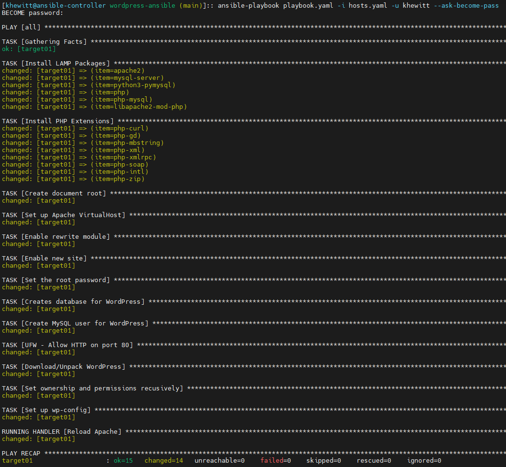
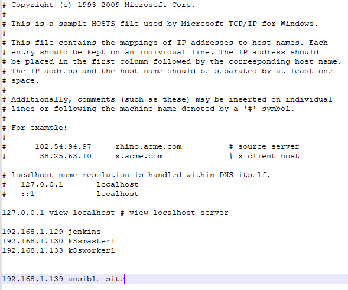
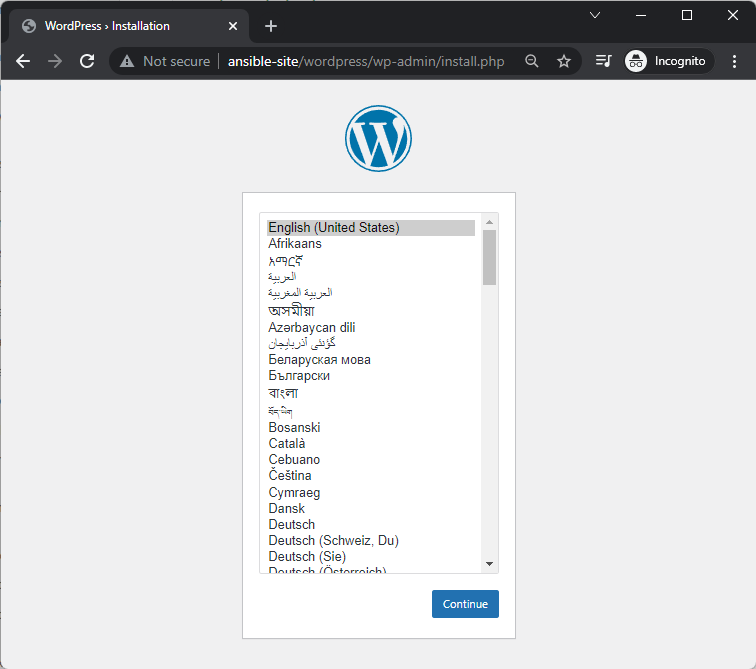
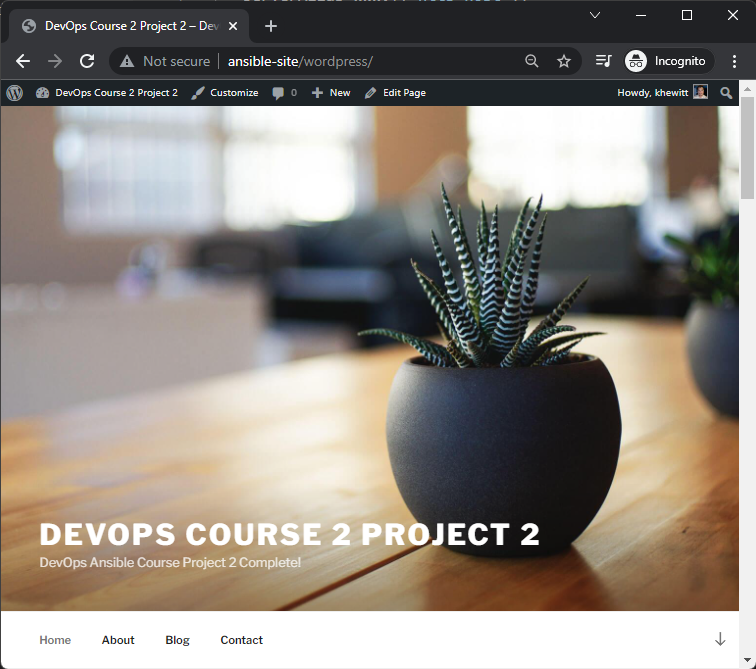

# DevOpsAnsibleProject2

* This is project 2 in course 2 of the CalTech DevOps post-graduate certificate program
* The objective of this project is to deploy a wordpress site on a target server using an ansible playbook

**__TABLE OF CONTENTS__**
- [DevOpsAnsibleProject2](#devopsansibleproject2)
  - [Problem Space](#problem-space)
    - [DESCRIPTION](#description)
  - [System Configuration](#system-configuration)
    - [Environemnt](#environemnt)
  - [Playbook description](#playbook-description)
  - [Configurations](#configurations)
    - [ansible.cfg](#ansiblecfg)
    - [playbook.yaml](#playbookyaml)
    - [Vault Passwords](#vault-passwords)
    - [apache.conf.j2](#apacheconfj2)
    - [wp-config.php.j2](#wp-configphpj2)
  - [Create Web Server](#create-web-server)
  - [Test](#test)

## Problem Space

---

### DESCRIPTION

You are a DevOps engineer at XYZ Ltd. Your company is working mostly on WordPress projects. A lot of development hours are lost to perform WordPress setup with all dependencies like PHP, MySQL, etc. The Company wants to automate it with the help of a configuration management tool so that they can follow a standard installation procedure for WordPress and its components whenever a new requirement or client comes in. The below mentioned components should be included:

- PHP
- Nginx/Apache Web Server
- MySQL
- WordPress
 

Steps to Perform:

- Establish configuration management master connectivity with WordPress server
- Validate connectivity from master to slave machine
- Prepare IaaC scripts to install WordPress and its dependent components
- Execute scripts to perform installation of complete WordPress environment
- Validate installation using the public IP of VM by accessing WordPress application

## System Configuration

---

### Environemnt 

* 2 Ubuntu 20.04.3 LTS VMs running on HyperV hypervisor
  * ansible-controller (192.168.1.140)
  * ansible-target (192.168.1.139)
    - Snapshot created after system initalization after ssh is enabled. This allows me to quickly revert the target for testing.
    - The following commands will install, enable and start ssh
      - `sudo apt install -y ssh`
      - `sudo systemctl enable ssh`
      - `sudo systemctl start ssh`
    - For ssh configuration issues, see `/etc/ssh/sshd_config`
    - The system defaults were not changed in my deployment
  * Personal repository hosted at https://github.com/RedOneLima/DevOpsAnsibleProject2
  * Host(s) Entires added to `C:\Windows\System32\drivers\etc\hosts`

## Playbook description

* Installs the nessisary packages using apt
* Installs the nessisary PHP Extentions
* Sets up Apache2 server
* Sets up MySQL database
* Configures Wordpress install
* Configures Firewall
* Handler to restart the webserver

## Configurations

### ansible.cfg

* The ansible.cfg is going to define the desired default behaviors
  * Ask for vault password for encrypted variables
  * Set the remote user to `khewitt`
  * reference the `hosts.yaml` as the default inventory
  * Ask for the sudo password before running the playbook

```bash
####################################################################
#                    Default configurations                        #
####################################################################

[defaults]
ask_vault_pass = True # Prompt for the vault password for encrypted
remote_user = khewitt # What user to run the playbook as
inventory = hosts.yaml # The default inventory

[privilege_escalation]
become_ask_pass = True # Prompt for the user sudo password
```

### playbook.yaml

* `mysql_root_password` - Specifies the new sql root pass
* `mysql_db` - The name of the database that wp will use
* `mysql_user` - The user that wp will use to access the database
* `mysql_password` - The wp database user password
* `http_host` - The name of the wordpress host. Note this is what needs to be set in /etc/hosts in order to access the correct path within the browser to access the page. If you don't want to use a hostname, make this the IP that will be used to access the wordpress page.
* `http_conf` - The name of the configuration file associated with the web host. Note this needs to be `http_host`.conf to work correctly.
* `http_port` - The port the server will listen to http requests on. Default web port is 80.

### Vault Passwords

* There are two passwords in the playbook configuration, `mysql_root_password` and `mysql_password`
* Since there are not any more secrets, maintaining an encrypyed secret file is not needed and instead string value encryption is all that is used in this playbook. 

* To create the encrypted strings:

```bash
> ansible-vault encrypt_string 'secret-string' --name 'secret-name'

New Vault password:
Confirm New Vault password:
secret-name: !vault |
          $ANSIBLE_VAULT;1.1;AES256
          39313261343739333962616433393335303135383235383135653331643239646664373430396562
          6534363232376238643635323439383039303834366332380a653434323261383038666435356333
          64303434313964353638303738323964333338616134396233643130303738313432303031623766
          3538353533633632380a653232623637653663383430623733653134626562326432646466313032
          3261
Encryption successful
```

* The password set here will be the one entered when prompted when the playbook is executed 


### apache.conf.j2

* This is a Jinja2 template for the virtaul host definintion

### wp-config.php.j2

* This is a Junja2 template for the wordpress PHP configuration
* This is where the MySQL database information is passed in for wp to be able to connect to the database.

## Create Web Server

* First, exchange ssh keys with the desired host(s)

```bash
[khewitt@ansible-controller ~]:: ssh-copy-id ansible-target

/usr/bin/ssh-copy-id: INFO: Source of key(s) to be installed: "/home/khewitt/.ssh/id_rsa.pub"
The authenticity of host 'ansible-target (192.168.1.139)' can't be established.
ECDSA key fingerprint is SHA256:78iHXb8a1Gn5wODf7Bf0Qdd+I5Qdpiip1lIKNo+Fcs0.
Are you sure you want to continue connecting (yes/no/[fingerprint])? yes
/usr/bin/ssh-copy-id: INFO: attempting to log in with the new key(s), to filter out any that are already installed
/usr/bin/ssh-copy-id: INFO: 1 key(s) remain to be installed -- if you are prompted now it is to install the new keys
khewitt@ansible-target's password:

Number of key(s) added: 1

Now try logging into the machine, with:   "ssh 'ansible-target'"
and check to make sure that only the key(s) you wanted were added.

```


* My hosts.yaml file specifies my target

```yaml
#############################################################################
#               Invintory of hosts named ansibleTargets
#############################################################################
---
ansibleTargets:
  hosts:
    target01:
      ansible_host: ansible-target
```

* Now we will run the playbook to configure the webpress server

```bash
ansible-playbook playbook.yaml
```


*Playbook run output*

* We can see that each of our tasks in our playbook generated a change on the target system (in yellow)

## Test

* We now have our server provisioned! Lets test our webserver.
* Lets make sure we have our hostname set in the **__host of the browser__** that will be accessing the site.
  * In my case, I will be accessing the web server through my Chrome browser on a Windows 11 desktop
  * Windows hosts file is found at `C:\Windows\System32\drivers\etc\hosts`
  * Linux hosts file is found at `/etc/hosts`

*C:\Windows\System32\drivers\etc\hosts*

* This matches the http configuration set in the playbook

```yaml
    http_host: "ansible-site"
    http_conf: "ansible-site.conf"
    http_port: "80"
```

* Now from our browser we can get to the WordPress setup portal at `http://ansible-site/wordpress` and be rereouted to the install page

*http://ansible-site/wordpress/wp-admin/install.php*

* We have a fully functioning wordpress site now. We can go through the website's admin UI to set up our website now. 

*http://ansible-site/wordpress*